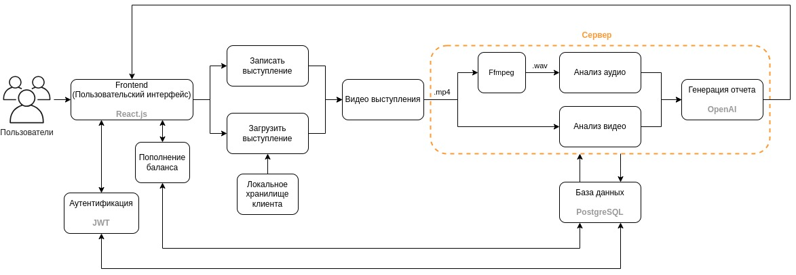

# SpeechPro

# Цели и предпосылки

## 1.1. Зачем идем в разработку продукта?

### Бизнес-цель:

- Создание и запуск мобильного приложения, помогающего старшеклассникам и студентам (16-26 лет) улучшить навыки публичных выступлений с помощью ИИ.
- Разработка ПО для помощи в тренировки выступлений с использованием технологии AI. Задача заключается в предоставлении рекомендаций пользователям по их выступлению с аргументацией на метрики, полученные посредством записи видео выступления.

### Почему станет лучше, чем сейчас, от использования ML:

- Получение независимой обратной связи по спичу.
- Позволит получать обратную связь по своему выступлению в любое время и в любой точке мира с телефона или компьютера.
- Более доступный вариант комплексной оценки выступления.

### Что считаем успехом:

- Достижение 1 000 активных пользователей в течение первого года.
- Получение положительных отзывов от 80% пользователей (более 4 из 5).

## 1.2. Бизнес-требования и ограничения

### Бизнес-требования:

- Интерфейс приложения должно быть интуитивно понятным в использовании и доступным для пользователей с разным уровнем технической подготовки.
- Анализ выступлений должен быть точным:

  - Качество транскрипции спича будет должным если WER<10%:

    $$
    \text{WER} = \frac{I + D + S}{N} \times 100
    $$

    - **Вставка (I)**: слова, неправильно добавленные в расшифровку гипотезы.
    - **Удаление (D)**: слова, не обнаруженные в расшифровке гипотезы.
    - **Замена (S)**: слова, отличающиеся между эталоном и гипотезой.
    - **Слова в исходной строке (N)**: общее число слов в размеченной человеком расшифровке.

    (пороговое значение WER взято из https://learn.microsoft.com/ru-ru/azure/ai-services/speech-service/how-to-custom-speech-evaluate-data?pivots=speech-studio)

  - Анализ видео состоит из определения настроения спикера и его положения тела, которые состоят из задач Emotion Recognition и Pose Classification. Будем использовать для этого метрики:

    - **Accuracy**: 70% и выше — хороший результат.
    - **F1-Score**: 0.7 и выше для каждого класса.
    - **AUC**: 0.7 и выше для многоклассовой задачи.
    - **Precision и Recall**: 0.7 и выше для ключевых эмоций.

- Отчет должен содержать более 75% полезных рекомендаций для загруженного выступления.
- Приложение должно мотивировать пользователей регулярно практиковаться.
- Стоимость разработки и поддержки приложения должна быть окупаемой на этапе выхода на рынок.

### Бизнес-ограничения:

- Ограниченный бюджет на разработку и маркетинг.
- Конкуренция со стороны других приложений для обучения ораторскому искусству.
- Необходимость постоянного обновления контента и функций приложения.

### Возможные пути развития проекта:

- Расширение целевой аудитории за счет добавления функций для более взрослых пользователей.
- Разработка дополнительных обучающих материалов и курсов.
- Геймификация по типу как в Дуалигно.
- Интеграция приложения с другими образовательными платформами.

### Возможные применения проекта:

- Подготовка к экзаменам и презентациям.
- Развитие лидерских качеств.
- Повышение навыков коммуникации в рабочих коллективах.
- Тренировка навыков публичных выступлений для актеров и других представителей творческих профессий.

### Типичный сценарий использования:

1. Пользователь входит в наше приложение и Он регистрируется в приложении, используя свой номер телефона или адрес электронной почты.
2. Пользователь записывает видео своего выступления и отправляет его в наш сервис.
3. Пользователь кратко описывает цель своего выступления в текстовом сообщении.
4. Видео и текстовое описание, отправляется на сервер приложения.
5. Сервер анализирует видео и аудиозапись выступления с помощью ИИ (CV, NLP).
6. Сервер генерирует отчет, который включает в себя (LLM):
   - Оценку выступления и также статистику (скорость речи, слова паразиты и тд).
   - Рекомендации по улучшению невербальной коммуникации (мимика, жесты).
   - Анализ структуры речи и советы по донесению информации.
   - Рекомендации по устранению речевых ошибок и оговорок.
7. На фронт отправляется отчет пользователю.
8. Пользователь может ознакомиться с отчетом и использовать его для улучшения своих навыков публичных выступлений.

## 1.3. Что входит в скоуп проекта/итерации, что не входит

### На закрытие каких БТ подписываемся в данной итерации

- Приложение должно быть простым в использовании и доступным для пользователей с разным уровнем технической подготовки.
- Стоимость разработки и поддержки приложения должна быть окупаемой.

### Что не будет закрыто

- Анализ выступлений должен быть точным и содержать полезные рекомендации.
- Стоимость разработки и поддержки приложения должна быть окупаемой.

### Описание результата с точки зрения качества кода и воспроизводимости решения

- По итогу итерации долен быть собран репозиторий с кодом соотвествующим pep8.

### Описание планируемого технического долга (что оставляем для дальнейшей продуктивизации)

- Тюнинг предобученных моделей под наши специфические данные.
- Разработка чистой архитектуры.
- Создание качественного UX/UI.

## 1.4. Предпосылки решения

- В первую очередь будут использоваться открытые датасеты по определению настроения на видео, текстовые датасеты. Ведутся переговоры по коллоборации с проектом Речевой день из ВШЭ по использованию размеченных данных и модели.

# Методология

## 2.1. Постановка задачи

### Задача:

- Разработка мобильного приложения, помогающего старшеклассникам и студентам (16-26 лет) улучшить навыки публичных выступлений с помощью ИИ.
  В частности будет доставаться адуиодорожка из видео и производиться транскрибация. Из этого текста выступления получаем статистику по словам, а из аудио получавем скорость речи и тд. Из видео получаем информацию о положение тела, мимие. В итоге вся эта информация суммаризируется в отчете в доступной для пользователя форме.

### Цель:

- Создать приложение, которое позволит пользователям:
  - Записывать и загружать видео своих выступлений.
  - Получать автоматизированный анализ своих выступлений с помощью ИИ.
  - Улучшать свои навыки невербальной коммуникации (мимика, жесты).
  - Развивать навыки структурирования речи и донесения информации.
  - Устранять речевые ошибки и оговорки.

### Описание задачи:

- **Входные данные**: Видеозаписи выступлений пользователей, текстовые описания целей выступлений.
- **Обработка**:
  - **Анализ видео**:
    - Определение метрик поведения тела и мимики.
    - Предоставление рекомендаций по улучшению невербальной коммуникации.
  - **Анализ речи**:
    - Транскрипция речи.
    - Анализ структуры речи и донесения информации.
    - Выявление речевых ошибок и оговорок.
    - Предоставление рекомендаций по улучшению вербальной коммуникации.
- **Выходные данные**: Отчет об анализе выступления, включающий в себя:
  - Оценку выступления.
  - Рекомендации по улучшению невербальной и вербальной коммуникации.
  - Конкретные примеры ошибок и способы их исправления.

### Блок-схема:

## 2.2. Критерии успеха технического решения

### Основные критерии:

- **Точность анализа**: Анализ выступления должен быть точным и содержать полезные рекомендации.
- **Полезность рекомендаций**: Рекомендации должны быть actionable, то есть легко выполнимыми и понятными пользователю.
- **Мотивация пользователей**: Приложение должно мотивировать пользователей регулярно практиковаться и совершенствовать свои навыки.
- **Простота использования**: Приложение должно быть простым в использовании и доступным для пользователей с разным уровнем технической подготовки.

### Дополнительные критерии:

- **Конфиденциальность данных**: Приложение должно обеспечивать конфиденциальность данных пользователей.
- **Производительность**: Приложение должно работать быстро и без сбоев.
- **Масштабируемость**
