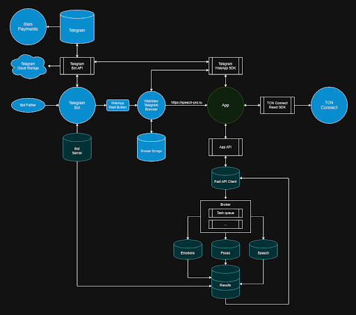

# SpeechPro

# Этап 1. Цели и предпосылки

## 1.1. Зачем идем в разработку продукта?

### Бизнес-цель:

- Создание и запуск мобильного приложения, помогающего старшеклассникам и студентам (16-26 лет) улучшить навыки публичных выступлений с помощью ИИ.
- Разработка ПО для помощи в тренировки выступлений с использованием технологии AI. Задача заключается в предоставлении рекомендаций пользователям по их выступлению с аргументацией на метрики, полученные посредством записи видео выступления.

### Почему станет лучше, чем сейчас, от использования ML:

- Получение независимой обратной связи по спичу.
- Позволит получать обратную связь по своему выступлению в любое время и в любой точке мира с телефона или компьютера.
- Более доступный вариант комплексной оценки выступления.

### Что считаем успехом:

- Достижение 1 000 активных пользователей в течение первого года.
- Получение положительных отзывов от 80% пользователей (более 4 из 5).

## 1.2. Бизнес-требования и ограничения

### Бизнес-требования:

- Интерфейс приложения должно быть интуитивно понятным в использовании и доступным для пользователей с разным уровнем технической подготовки.
- Анализ выступлений должен быть точным:

  - Качество транскрипции спича будет должным если WER<10%:

    $$
    \text{WER} = \frac{I + D + S}{N} \times 100
    $$

    - **Вставка (I)**: слова, неправильно добавленные в расшифровку гипотезы.
    - **Удаление (D)**: слова, не обнаруженные в расшифровке гипотезы.
    - **Замена (S)**: слова, отличающиеся между эталоном и гипотезой.
    - **Слова в исходной строке (N)**: общее число слов в размеченной человеком расшифровке.

    (пороговое значение WER взято из https://learn.microsoft.com/ru-ru/azure/ai-services/speech-service/how-to-custom-speech-evaluate-data?pivots=speech-studio)

  - Анализ видео состоит из определения настроения спикера и его положения тела, которые состоят из задач Emotion Recognition и Pose Classification. Будем использовать для этого метрики:

    - **Accuracy**: 70% и выше — хороший результат.
    - **F1-Score**: 0.7 и выше для каждого класса.
    - **AUC**: 0.7 и выше для многоклассовой задачи.
    - **Precision и Recall**: 0.7 и выше для ключевых эмоций.

- Отчет должен содержать более 75% полезных рекомендаций для загруженного выступления.
- Приложение должно мотивировать пользователей регулярно практиковаться.
- Стоимость разработки и поддержки приложения должна быть окупаемой на этапе выхода на рынок.

### Бизнес-ограничения:

- Ограниченный бюджет на разработку и маркетинг.
- Конкуренция со стороны других приложений для обучения ораторскому искусству.
- Необходимость постоянного обновления контента и функций приложения.

### Возможные пути развития проекта:

- Расширение целевой аудитории за счет добавления функций для более взрослых пользователей.
- Разработка дополнительных обучающих материалов и курсов.
- Геймификация по типу как в Дуалигно.
- Интеграция приложения с другими образовательными платформами.

### Возможные применения проекта:

- Подготовка к экзаменам и презентациям.
- Развитие лидерских качеств.
- Повышение навыков коммуникации в рабочих коллективах.
- Тренировка навыков публичных выступлений для актеров и других представителей творческих профессий.

### Типичный сценарий использования:

1. Пользователь входит в наше приложение и Он регистрируется в приложении, используя свой номер телефона или адрес электронной почты.
2. Пользователь записывает видео своего выступления и отправляет его в наш сервис.
3. Пользователь кратко описывает цель своего выступления в текстовом сообщении.
4. Видео и текстовое описание, отправляется на сервер приложения.
5. Сервер анализирует видео и аудиозапись выступления с помощью ИИ (CV, NLP).
6. Сервер генерирует отчет, который включает в себя (LLM):
   - Оценку выступления и также статистику (скорость речи, слова паразиты и тд).
   - Рекомендации по улучшению невербальной коммуникации (мимика, жесты).
   - Анализ структуры речи и советы по донесению информации.
   - Рекомендации по устранению речевых ошибок и оговорок.
7. На фронт отправляется отчет пользователю.
8. Пользователь может ознакомиться с отчетом и использовать его для улучшения своих навыков публичных выступлений.

## 1.3. Что входит в скоуп проекта/итерации, что не входит

### На закрытие каких БТ подписываемся в данной итерации

- Приложение должно быть простым в использовании и доступным для пользователей с разным уровнем технической подготовки.
- Стоимость разработки и поддержки приложения должна быть окупаемой.

### Что не будет закрыто

- Анализ выступлений должен быть точным и содержать полезные рекомендации.
- Стоимость разработки и поддержки приложения должна быть окупаемой.

### Описание результата с точки зрения качества кода и воспроизводимости решения

- По итогу итерации долен быть собран репозиторий с кодом соотвествующим pep8.

### Описание планируемого технического долга (что оставляем для дальнейшей продуктивизации)

- Тюнинг предобученных моделей под наши специфические данные.
- Разработка чистой архитектуры.
- Создание качественного UX/UI.

## 1.4. Предпосылки решения

- В первую очередь будут использоваться открытые датасеты по определению настроения на видео, текстовые датасеты. Ведутся переговоры по коллоборации с проектом Речевой день из ВШЭ по использованию размеченных данных и модели.

# Этап 2. Методология

## 2.1. Постановка задачи

### Задача:

- Разработка мобильного приложения, помогающего старшеклассникам и студентам (16-26 лет) улучшить навыки публичных выступлений с помощью ИИ.
  В частности будет доставаться адуиодорожка из видео и производиться транскрибация. Из этого текста выступления получаем статистику по словам, а из аудио получавем скорость речи и тд. Из видео получаем информацию о положение тела, мимие. В итоге вся эта информация суммаризируется в отчете в доступной для пользователя форме.

### Цель:

- Создать приложение, которое позволит пользователям:
  - Записывать и загружать видео своих выступлений.
  - Получать автоматизированный анализ своих выступлений с помощью ИИ.
  - Улучшать свои навыки невербальной коммуникации (мимика, жесты).
  - Развивать навыки структурирования речи и донесения информации.
  - Устранять речевые ошибки и оговорки.

### Описание задачи:

- **Входные данные**: Видеозаписи выступлений пользователей, текстовые описания целей выступлений.
- **Обработка**:
  - **Анализ видео**:
    - Определение метрик поведения тела и мимики.
    - Предоставление рекомендаций по улучшению невербальной коммуникации.
  - **Анализ речи**:
    - Транскрипция речи.
    - Анализ структуры речи и донесения информации.
    - Выявление речевых ошибок и оговорок.
    - Предоставление рекомендаций по улучшению вербальной коммуникации.
- **Выходные данные**: Отчет об анализе выступления, включающий в себя:
  - Оценку выступления.
  - Рекомендации по улучшению невербальной и вербальной коммуникации.
  - Конкретные примеры ошибок и способы их исправления.

### Блок-схема:

## 2.2. Критерии успеха технического решения

### Основные критерии:

- **Точность анализа**: Анализ выступления должен быть точным и содержать полезные рекомендации.
- **Полезность рекомендаций**: Рекомендации должны быть actionable, то есть легко выполнимыми и понятными пользователю.
- **Мотивация пользователей**: Приложение должно мотивировать пользователей регулярно практиковаться и совершенствовать свои навыки.
- **Простота использования**: Приложение должно быть простым в использовании и доступным для пользователей с разным уровнем технической подготовки.

### Дополнительные критерии:

- **Конфиденциальность данных**: Приложение должно обеспечивать конфиденциальность данных пользователей.
- **Производительность**: Приложение должно работать быстро и без сбоев.
- **Масштабируемость**

## 2.3. Этапы решения задачи

- **Speech-to-Text**:

Для задачи Speech-to-Text планируется применять предобученную модель Whisper от OpenAI. Поэтому вероятно необходимости дообучать модель на этапе MVP не появиться. Важным фактором является то, что основная аудитория сервиса предполагается из России, то упор стоит делать на распознавание русской речи.

От пользователей мы будем получать видео в различных форматах, которые желательно привести в один формат для упрощения работы с ними (например, .mp4). Также как вариант можно ввести ограничение на загрузку форматов файлов, чтобы пользователь не мог использовать "экзотические" варианты форматов.
При этом большинство моделей принимают на вход аудиофайлы формата .wav, который мы можем получить из .mp4 с помощью Ffmpeg.
Так к требованиям можно привести:

1. **Частота дискретизации (Sampling Rate)**

   - **Рекомендуемое значение**: 16 кГц (16000 Гц) или 44.1 кГц.
   - **Примечание**: Частота дискретизации влияет на качество звука. Если файл имеет слишком низкую частоту дискретизации, распознавание речи может быть менее точным. 16 кГц — это стандарт для большинства моделей, использующих speech-to-text.

2. **Количество каналов (Channels)**

   - **Рекомендуемое значение**: 1 (моно).
   - **Примечание**: Для большинства алгоритмов Speech-to-Text используется монофоническое аудио. Если файл в стерео, его нужно привести к монофоническому формату. Два канала могут усложнить процесс распознавания.

3. **Глубина битов (Bit Depth)**

   - **Рекомендуемое значение**: 16 бит.
   - **Примечание**: Это стандартная глубина для аудиофайлов, которая обеспечивает достаточную детализацию звука. Большая глубина битов (например, 24 бита) может быть избыточной для распознавания речи.

4. **Формат WAV**

   - **Тип кодека**: PCM (Pulse Code Modulation).
   - **Примечание**: Это стандартный несжатый формат, который широко используется для аудиообработки и является наиболее подходящим для задачи Speech-to-Text.

5. **Продолжительность записи**

   - Продолжительность записи может варьироваться в зависимости от модели распознавания. Обычно модели могут обрабатывать как короткие записи (несколько секунд), так и длинные (несколько минут). Однако для очень длинных аудиофайлов может потребоваться разделение записи на более короткие сегменты.
     Так в основном продолжительность выступлений составляет 5-10 минут.

6. **Шум в аудио**
   - **Рекомендуется минимизировать фоновый шум**.
   - Если в аудиофайле присутствуют сильные помехи или фоновый шум, это может снизить точность распознавания. Хорошее качество записи с минимальным фоновым шумом улучшит результаты.

### Этап 1. Подготовка данных

### 1. Описание данных/сущностей, выявленные проблемы с объемом/качеством/разметкой и риски на этапе EDA

### Описание данных/сущностей:

На этапе **EDA** (Exploratory Data Analysis) важно исследовать структуру данных, чтобы понять их содержание и выявить потенциальные проблемы. В случае данных для задачи **Speech-to-Text** (например, аудиофайлы в формате `.wav` и связанные с ними текстовые метки), сущности могут включать:

- **Аудиофайлы**: Представляют собой записи речи, которые будут анализироваться.
- **Текстовые метки**: Тексты, соответствующие аудиофайлам, которые будут использоваться для обучения модели распознавания речи.

На этапе анализа следует определить:

- Сколько уникальных записей в наборе данных?
- Какое соотношение между аудиофайлами и метками?

### Выявленные проблемы с объемом/качеством/разметкой:

- **Объем**:

  - Недостаточное количество данных может привести к плохой обобщаемости модели. Для успешного обучения модели на реальных данных необходимо большое количество примеров с разнообразной речью (различные акценты, возрастные группы, шумы и т. д.).
  - **Решение**: Увеличение объема данных с помощью дополнения данных (data augmentation) или добавления новых аудиофайлов.

- **Качество**:

  - Если аудиофайлы имеют низкое качество (шум, искажения, неправильное кодирование), модель будет плохо обучаться.
  - Тоже самое будет если у датасета очень высокое качество записи, так как у пользователей вероятно будут обычные устройства для записи звука.
  - **Решение**: Применение предобработки данных (например, шумоподавление) для улучшения качества аудио. Использовать данные записанные на целевом устройстве.

- **Разметка**:
  - Ошибки в текстовых метках (например, несоответствие между аудио и текстом или неправильно расставленные знаки препинания) могут значительно ухудшить точность модели.
  - **Решение**: Проверка и корректировка разметки перед обучением.

### Риски и проблемы на этапе EDA:

- **Неравномерность распределения данных**:

  - Некоторые классы или акценты могут быть недостаточно представлены, что приведет к проблемам при обобщении модели на малоизвестные данные.
  - **Решение**: Балансировка классов и добавление данных с недостаточными акцентами.

- **Наличие шума**:

  - Фоновые шумы могут сильно мешать распознаванию речи.
  - **Решение**: Использование алгоритмов для подавления шума или применение чистых записей в процессе обучения.

- **Недостаток разнообразия в речи**:
  - В идеале нужно собрать данные от разных говорящих, с разными тембрами и акцентами, чтобы модель могла работать с различными вариантами произношения.
  - **Решение**: Привлечение большего количества участников для записи речи с различными акцентами (свой датасет).

---

### 2. Описание процесса генерации данных

### Откуда данные поступают:

Данные могут поступать из различных источников:

- **Открытые датасеты**: Например, CommonVoice, LibriSpeech, TED-LIUM и другие.
- **Собственные записи**: Данные могут быть собраны с помощью специальных программ или приложений для записи речи.
- **Симулированные данные**: В некоторых случаях можно генерировать искусственные данные с помощью текстов, преобразованных в речь с помощью синтезаторов речи.

### В каком формате:

- Аудиофайлы обычно имеют формат `.wav` или `.flac`, кодированные в PCM (несжатый формат).
- Текстовые метки часто хранятся в виде текстовых файлов или в формате CSV/JSON с указанием пути к аудиофайлу и соответствующей текстовой меткой.

### Как выглядит процесс:

Процесс генерации данных может включать запись аудио с разных источников, обработку для улучшения качества (например, удаление шума), а также разметку аудио для создания пары "аудио-текст".

- Если данные генерируются вручную, для каждого аудиофайла необходимо создавать метку текста.

### Регулярность:

Процесс может быть регулярным, если данные поступают автоматически (например, через краудсорсинг), или нерегулярным, если нужно вручную записывать и разметить аудио.

---

## 3. Если данных недостаточно, способы решения проблемы

### Каковы способы решения этой проблемы:

- **Дополнение данных**:
  - Использование методов увеличения данных (data augmentation), таких как изменение скорости, добавление шума, изменение высоты тона.
- **Синтетические данные**:
  - Можно использовать синтезаторы речи (например, Tacotron или WaveNet) для создания дополнительных данных на основе текстов.
- **Собственные записи**:
  - Запись новых аудиофайлов с разнообразными голосами и акцентами.

---

## 4. Наличие конфиденциальной информации

### Есть ли в данных конфиденциальная информация?

В аудиофайлах могут быть записаны личные данные, если они касаются частных разговоров, конфиденциальной информации или данных, содержащих персональную информацию.

### Как нужно обрабатывать конфиденциальную информацию?

Для соблюдения стандартов конфиденциальности и законодательства (например, GDPR) необходимо:

- Анонимизировать записи (удалить имена или идентифицируемые данные).
- Хранить данные с соблюдением безопасности, например, использовать шифрование.
- Обеспечить согласие на обработку данных от всех участников.

---

## 5. Необходимый результат этапа

На этапе EDA необходимо:

- Получить полное представление о качестве и структуре данных.
- Выявить проблемы, такие как ошибки в разметке, проблемы с качеством данных, дисбаланс классов.
- Применить необходимые преобразования или улучшения для подготовки данных к обучению модели.

## Этап 2. Подготовка прогнозных моделей

## 1. Описание ML-метрик и функций потерь, выбранных для решения задачи с обоснованием этого выбора

### ML-метрики:

Для задачи **Speech-to-Text** (распознавание речи) основными метриками будут:

- **Word Error Rate (WER)**:
  - **Описание**: Измеряет количество ошибок (вставки, пропуски и замены) на основе сравнения распознанного текста с реальным.
  - **Обоснование**: WER является стандартной метрикой для задач распознавания речи, так как напрямую отражает точность перевода аудио в текст.
- **Character Error Rate (CER)**:

  - **Описание**: Измеряет количество ошибок на уровне символов.
  - **Обоснование**: В некоторых случаях, когда важно работать с более детализированным текстом, CER может быть полезной метрикой.

- **Precision, Recall и F1-Score**:
  - **Описание**: Метрики для оценки точности и полноты распознавания речи в контексте классификации (например, выделение ключевых слов).
  - **Обоснование**: Для задач с несколькими классами (например, распознавание отдельных слов или фраз) важно использовать эти метрики для оценки производительности модели.

### Функции потерь:

- **CTC Loss (Connectionist Temporal Classification)**:
  - **Описание**: Это стандартная функция потерь для задачи распознавания речи, особенно если длина аудиофайла и текста не совпадает.
  - **Обоснование**: CTC позволяет модели делать прогнозы, не имея явной маркировки времени для каждого слова, что идеально подходит для задачи Speech-to-Text.

---

## 2. Описание схемы ML-валидации, с учетом специфики состава данных, бизнес-задачи, функциональных и нефункциональных требований

### Схема ML-валидации:

- **Кросс-валидация**:
  - Для проверки модели будет использоваться кросс-валидация (например, 5-фолд), чтобы убедиться в ее способности обобщать на новых данных.
- **Обоснование выбора**:

  - В задаче распознавания речи важно избежать переобучения, так как модель может запомнить специфические характеристики аудиофайлов. Кросс-валидация поможет повысить стабильность и надежность модели.

- **С учетом специфики данных**:
  - Мы будем учитывать разнообразие акцентов, фонов, тембров голосов, чтобы валидировать модель на разных группах данных.

### Функциональные и нефункциональные требования:

- **Функциональные требования**:
  - Высокая точность распознавания речи в условиях шума и различных акцентов.
- **Нефункциональные требования**:
  - Время отклика модели должно быть минимальным, что важно для реального применения в режиме реального времени.

---

## 3. Описание структуры бейзлайна (одного или нескольких), предобработки и процесса моделирования для бейзлайна

### Структура бейзлайна:

1. **Предобработка**:
   - **Шумоподавление**: Применение алгоритмов для удаления фонового шума.
   - **Монофоническое преобразование**: Преобразование стереоформатов в моно для упрощения распознавания.
   - **Мел-частотные кепстральные коэффициенты (MFCC)**: Использование MFCC для извлечения признаков из аудио.
2. **Моделирование**:

   - **Модель**: Для бейзлайна можно использовать простую модель на основе **RNN** или **LSTM**, которая будет работать с признаками аудио.
   - **Оптимизация**: Использование стандартных оптимизаторов, таких как Adam.

3. **Предсказание**:
   - Модель будет делать предсказания на основе извлеченных признаков, которые затем будут преобразованы в текст.

### Процесс моделирования:

- Выбор подходящих гиперпараметров.
- Оптимизация модели на основе функции потерь (CTC).
- Оценка результатов на валидационном наборе данных.

---

## 4. Стратегии дальнейшего развития решения

### Выбор моделей:

- После бейзлайна можно исследовать более сложные модели:
  - **Transformer-based модели** (например, Wav2Vec, DeepSpeech).
  - **End-to-end модели**, которые напрямую обучаются на аудио.

### Предобработка:

- Углубленная предобработка для улучшения качества данных:
  - Дополнение данных с использованием различных типов шума и искажения.
  - Применение методов для улучшения качества речи.

### Feature Engineering (FE):

- Извлечение дополнительных признаков, таких как:
  - **Температурные коэффициенты**.
  - **Фоновый шум и его удаление**.

### Оптимизация гиперпараметров:

- Использование **Grid Search** или **Random Search** для оптимизации параметров модели.
- Тонкая настройка структуры сети, включая количество слоев, нейронов и скорости обучения.

---

## 5. Анализ и интерпретация работы модели

- **Оценка точности**: Использование метрик (например, WER, CER) для анализа качества работы модели.
- **Ошибки модели**: Выявление и анализ ошибок, таких как неверное распознавание или пропуски слов.
- **Интерпретация предсказаний**: Оценка предсказаний модели с помощью визуализаций и ошибок на тестовых данных.

---

## 6. Риски данного этапа и способы их снижения

### Риски:

1. **Переобучение модели**:

   - Модель может запомнить особенности тренировочных данных и плохо обобщать на новых данных.
   - **Способ снижения**: Использование кросс-валидации, регуляризация (например, dropout), увеличение объема данных.

2. **Низкое качество данных**:

   - Шумы или плохое качество аудио могут снизить точность распознавания.
   - **Способ снижения**: Применение передовых методов шумоподавления и улучшение качества аудио.

3. **Несоответствие данных**:
   - Модель может плохо работать с акцентами или редкими словами.
   - **Способ снижения**: Собрать разнообразные данные с различными акцентами и возрастными группами.

---

## 7. Необходимый результат этапа

- Построение базовой модели, которая служит отправной точкой для дальнейших улучшений.
- Оценка модели с использованием метрик качества и анализ ошибок.
- Предложение возможных путей для улучшения модели (например, использование более сложных архитектур).

# Этап 3. Подготовка пилота

## 3.1. Способ оценки пилота

### Описание дизайна

Пилотный проект включает разработку и тестирование веб-приложения в Telegram для улучшения навыков публичных выступлений. Пользователи могут записывать или загружать короткие выступления (до 1 минуты). Интерфейс приложения включает:

- **Нижняя панель**: Полоса с тремя иконками для навигации.
- **Левая часть**: Настройки профиля и пользовательские предпочтения.
- **Центральная часть**: Интерфейс записи и загрузки выступления.
- **Правая часть**: Меню с подробной обратной связью.

Обратная связь включает:

- Транскрипцию выступления.
- Среднюю скорость речи (слов в минуту).
- Оценка позы выступающего.
- Общий эмоциональный тон спикера.
- Индивидуальный отчёт с рекомендациями для улучшения.

### Процесс оценки

Эффективность пилота будет оцениваться с помощью экспертного анализа. Десять участников будут приглашены для тестирования системы и оценки её удобства, точности и качества обратной связи на основе заранее определённых критериев.

### Критерии оценки

1. **Точность:**
   - Корректность транскрипции речи.
   - Валидность вычисленных метрик (например, средней скорости, эмоционального тона).
2. **Пользовательский опыт:**
   - Интуитивно понятный интерфейс.
   - Лёгкость навигации и использования.
3. **Полезность обратной связи:**
   - Понятность и применимость генерируемых рекомендаций.
   - Соответствие анализа эмоций и скорости речи задачам улучшения выступлений.

## 3.2. Что считаем успешным пилотом

### Метрики успеха

1. **Количественные метрики:**
   - **Точность транскрипции речи**: Минимум 90% точности по сравнению с ручной транскрипцией.
   - **Надёжность метрики скорости**: Среднее отклонение менее 10% от базовых измерений.
   - **Валидность анализа эмоций**: Не менее 80% совпадения с ручной оценкой эмоционального тона.
2. **Качественные метрики:**
   - **Удовлетворённость пользователей**: Средний балл 4.0 или выше по 5-балльной шкале за удобство и полезность обратной связи.
   - **Экспертное одобрение**: Положительная оценка от минимум 7 из 10 рецензентов.

### Порог успеха

- Достижение указанных метрик при сохранении стабильности и отзывчивости системы.
- Минимальная задержка обработки (среднее время ответа менее 10 секунд на запрос обратной связи).

## 3.3. Подготовка пилота

### Ограничения ресурсов

Учитывая ограниченные вычислительные ресурсы, система будет использовать лёгкие модели машинного обучения и эффективные методы обработки. Тяжёлые модели будут исключены в пользу:

- Предобученных облегчённых моделей для анализа эмоций, позы и тд.
- Пакетной обработки для некритичных вычислений с целью снижения нагрузки в реальном времени.

### Оценка вычислительной сложности

1. Проведение базового эксперимента с использованием небольшого набора данных для:

   - Измерения среднего времени выполнения ключевых вычислений (транскрипция, анализ скорости, анализ эмоций).
   - Выявления потенциальных узких мест и их оптимизации.

2. Определение ограничений системы:
   - Длина выступления ограничена 1 минутой.
   - Обратная связь в реальном времени приоритетна, более сложный анализ может выполняться после завершения сессии.

### Итеративное уточнение

На основе базовых экспериментов параметры пилота и вычислительные требования будут скорректированы для:

- Обеспечения отзывчивости системы.
- Предотвращения перегрузки серверной инфраструктуры.
- Соблюдения сроков развёртывания.

## Обоснование выбора платформы

Платформа Telegram Web App выбрана из-за:

- Популярности и знакомства пользователей с Telegram.
- Кроссплатформенности, обеспечивающей доступ с различных устройств.
- Упрощённой интеграции системы авторизации Telegram через ID пользователя, что упрощает процесс регистрации и безопасность данных.

# Этап 4. Внедрение

## 4.1. Архитектура решения

## **4.2. Описание инфраструктуры и масштабируемости**

#### **4.2.1 Выбранная инфраструктура**

- Docker Compose для управления контейнерами.
- **Облачные платформы:** S3-совместимое хранилище (например, MinIO) для хранения медиафайлов.
- **Микросервисы:** Каждый компонент (аудио, видео, отчёты, авторизация) изолирован, что позволяет масштабировать их независимо.

#### **4.2.2 Плюсы и минусы выбора**

- **Плюсы:**
  - Простота настройки и деплоя.
  - Удобство локальной разработки и тестирования.
  - Низкая стоимость инфраструктуры.
- **Минусы:**
  - Ограниченные возможности масштабирования по сравнению с Kubernetes.
  - Менее сложная оркестрация.

#### **4.2.3 Почему выбранный вариант лучше**

Использование Docker Compose упрощает настройку и эксплуатацию для небольшого продукта, снижая затраты на инфраструктуру, что идеально подходит для стартапа на раннем этапе.

---

### **4.3. Требования к работе системы**

- **SLA (Service Level Agreement):**
  - Готовность системы: 99.5%.
  - Максимальное время обработки видео: 5 минут для файлов до 100 МБ.
- **Пропускная способность:**
  - Поддержка до 100 параллельных пользователей.
- **Задержка:**
  - Средняя задержка обработки одной задачи (анализ + отчёт): до 2 минут.

---

### **4.4. Безопасность системы**

#### **4.4.1 Потенциальные уязвимости**

- **Возможность загрузки вредоносных файлов.**
  - Решение: проверка файлов перед обработкой (антивирусные сканеры).
- **Неавторизованный доступ к данным пользователей.**
  - Решение: шифрование JWT токенов, HTTPS для передачи данных.

---

### **4.5. Безопасность данных**

#### **4.5.1 Соответствие законам (GDPR и др.)**

- Хранение данных пользователей ограничено минимально необходимым сроком.
- Данные, которые могут идентифицировать пользователя, хранятся в зашифрованном виде.
- У пользователей есть возможность запросить удаление своих данных.

---

### **4.6. Издержки**

#### **Расчетные ежемесячные издержки на сервер с GPU:**

- 8 vCPU ; 5 241,98 ₽
- 24 ГБ RAM ; 5 718,53 ₽
- 1 × GTX 1080 (8 ГБ); 10 571,10 ₽
- 100 ГБ Сетевой — Базовый SSD ; 899,3 8 ₽
- 1 000 ГБ Сетевой — Базовый HDD ; 7 276,64 ₽

Итого: ~30000 ₽/мес.

#### **Стоимость аккаунта Apple Developer (при разработке приложения на iOS):**

- 10000 ₽/год = 9166 ₽/мес

#### **Зарплатный фонд (минимальная команда):**

- ~350000 ₽/мес.

---

### **4.7. Integration points**

#### **Основные взаимодействия между сервисами:**

- **Frontend -> Backend:**
  - Загрузка видео, получение статуса обработки, получение отчётов.
  - Методы: POST `/upload`, GET `/report/{id}`.
- **Backend -> ML-сервисы:**
  - Отправка задач на обработку аудио и видео.
  - Методы: POST `/process/audio`, POST `/process/video`.
- **ML-сервисы -> База данных:**
  - Сохранение результатов анализа.
- **LLM -> Backend:**
  - Формирование итогового отчёта.
  - Методы: POST `/generate/report`.
- **Backend -> Уведомления:**
  - Уведомление о завершении анализа.
  - Методы: POST `/notify/user`.

---

### **4.8. Риски**

- **Непредсказуемая нагрузка на систему:**
  - Решение: использование резервных серверов.
- **Сбой в ML-моделях или превышение времени обработки:**
  - Решение: мониторинг задач и повторная обработка при сбоях.
- **Проблемы с конфиденциальностью данных:**
  - Решение: строгий контроль доступа, шифрование.

---
